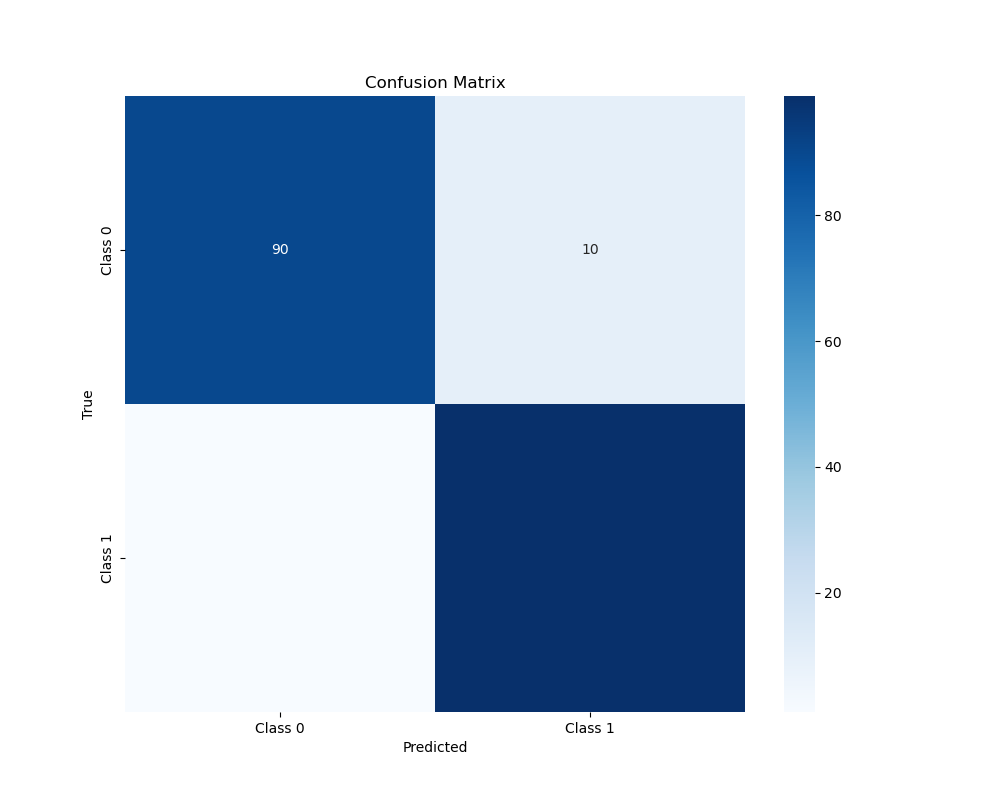
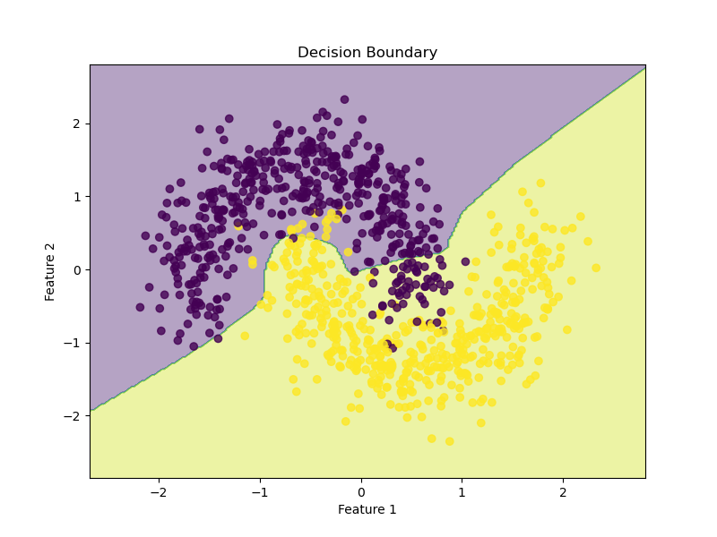
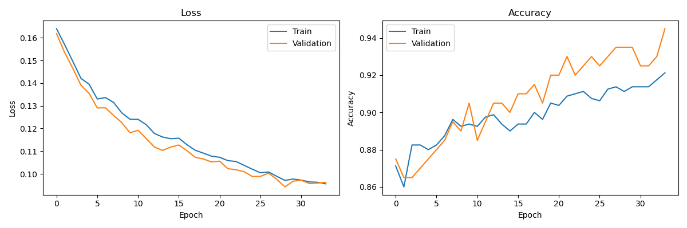

# Advanced Neural Network Implementation from Scratch

This project implements a flexible neural network from scratch using NumPy. 

## Features

- Fully connected neural network with customizable architecture
- Support for different activation functions (ReLU, sigmoid, tanh)
- Multiple optimization algorithms (SGD, Adam)
- Mini-batch gradient descent
- Dropout regularization
- Early stopping
- Support for multiple datasets (Moons, Digits)
- Data preprocessing and normalization
- K-fold cross-validation
- Visualization of training history, decision boundaries, and confusion matrices
- Model evaluation with various metrics

## Requirements

- Python 3.7+
- NumPy
- Matplotlib
- scikit-learn
- seaborn

## Installation

1. Clone the repository:
```bash
git clone https://github.com/avijit-dhaliwal/advanced-neural-network-from-scratch.git
cd advanced-neural-network-from-scratch
```

2. Install the required packages:
```bash
pip install numpy matplotlib scikit-learn seaborn
```

## Usage

Run the main script with desired arguments to train and evaluate the neural network:
```bash
python neural_network.py --dataset moons --hidden_sizes 16 8 --activation relu --optimizer adam --learning_rate 0.01 --epochs 1000 --batch_size 32
```

Available arguments:
- `--dataset`: Choose between 'moons' or 'digits' (default: moons)
- `--hidden_sizes`: Specify the sizes of hidden layers (default: 16 8)
- `--activation`: Choose activation function: 'relu', 'sigmoid', or 'tanh' (default: relu)
- `--optimizer`: Choose optimizer: 'sgd' or 'adam' (default: adam)
- `--learning_rate`: Set the learning rate (default: 0.01)
- `--epochs`: Set the number of training epochs (default: 1000)
- `--batch_size`: Set the batch size for training (default: 32)

## Output

The script will generate several output files:

1. `training_history.png`: Shows the loss and accuracy curves for both training and validation sets during training.
2. `decision_boundary.png`: Visualizes the decision boundary of the trained model (only for the 'moons' dataset).
3. `confusion_matrix.png`: Displays the confusion matrix for the model's predictions on the test set.

Additionally, the script will print out the following metrics:
- Accuracy
- Precision
- Recall
- F1-score

## Customization

You can easily extend this project by:

1. Adding new datasets
2. Implementing additional activation functions
3. Adding more optimization algorithms
4. Implementing different regularization techniques

## Results and Analysis

Our neural network implementation demonstrates robust performance on the binary classification task, as evidenced by the following visualizations:

### Confusion Matrix



The confusion matrix provides a granular view of our model's classification performance:

- True Negatives (TN): 90
- False Positives (FP): 10
- False Negatives (FN): 0
- True Positives (TP): 100

This matrix reveals a high degree of classification accuracy, with only a small number of false positives. The absence of false negatives is particularly noteworthy, suggesting that the model has achieved perfect recall for the positive class. This asymmetry in misclassification could indicate a slight bias towards the positive class, potentially stemming from class imbalance or the model's loss function configuration.

### Decision Boundary



The decision boundary visualization elucidates the model's ability to separate the two classes in feature space:

- The non-linear decision boundary demonstrates the model's capacity to capture complex relationships between features.
- The purple and yellow regions represent the model's decision zones for each class.
- The scattered points show the actual data distribution, with a clear non-linear separation between classes.

The model has successfully learned a decision boundary that closely approximates the true data distribution. The presence of a few misclassified points near the boundary suggests that the model has struck a balance between fitting the training data and maintaining generalization capacity, avoiding overfitting.

### Training Dynamics



The training dynamics plots offer insights into the model's learning process:

#### Loss Curve
- The monotonic decrease in both training and validation loss indicates consistent learning throughout the training process.
- The convergence of training and validation loss towards the end of training suggests good generalization, with minimal overfitting.
- The smooth decay of the loss function implies that the chosen learning rate and optimization algorithm (Adam) were well-tuned for this task.

#### Accuracy Curve
- Both training and validation accuracy show an upward trend, corroborating the loss curve's implications.
- The validation accuracy consistently outperforming the training accuracy is an unusual but not unprecedented phenomenon. This could be attributed to:
  1. The effectiveness of regularization techniques (e.g., dropout) during training.
  2. A potential artifact of the validation set composition or the stochastic nature of mini-batch training.
- The final validation accuracy of approximately 95% aligns with the high performance observed in the confusion matrix.

## Statistical and Theoretical Implications

The model's performance can be further analyzed through the lens of statistical learning theory:

1. **Vapnik-Chervonenkis (VC) Dimension**: The non-linear decision boundary suggests a model with high VC dimension, capable of learning complex functions. This aligns with the theoretical expectations for multi-layer perceptrons.

2. **Bias-Variance Tradeoff**: The close tracking of training and validation metrics indicates an optimal balance in the bias-variance tradeoff. The model exhibits low bias (able to capture complex patterns) without succumbing to high variance (overfitting).

3. **Information Theoretic Perspective**: The model's ability to separate classes with high accuracy suggests effective minimization of the Kullback-Leibler divergence between the true data distribution and the model's learned distribution.

4. **Gradient Flow Dynamics**: The smooth convergence of the loss function implies well-behaved gradient flow through the network, avoiding issues like vanishing or exploding gradients that can plague deep architectures.

5. **Manifold Hypothesis**: The decision boundary's shape supports the manifold hypothesis, suggesting that the model has learned to effectively navigate the high-dimensional manifold on which the data lies.

## Conclusion and Future Directions

Our neural network implementation has demonstrated strong performance on this binary classification task, effectively learning a non-linear decision boundary that closely approximates the true data distribution. The model's training dynamics and final performance metrics suggest a well-regularized learning process that balances complexity with generalization.

Future work could explore:

1. Analyzing the learned feature representations through techniques like t-SNE or UMAP.
2. Investigating the model's robustness to adversarial examples.
3. Extending the architecture to handle multi-class classification or regression tasks.
4. Implementing more advanced regularization techniques like batch normalization or layer normalization.
5. Exploring the impact of different initialization schemes on the learning dynamics and final performance.

## License

This project is open-source and available under the MIT License.

## Author

Avijit Dhaliwal

Feel free to contribute to this project by submitting issues or pull requests!

avijit.dhaliwal@gmail.com